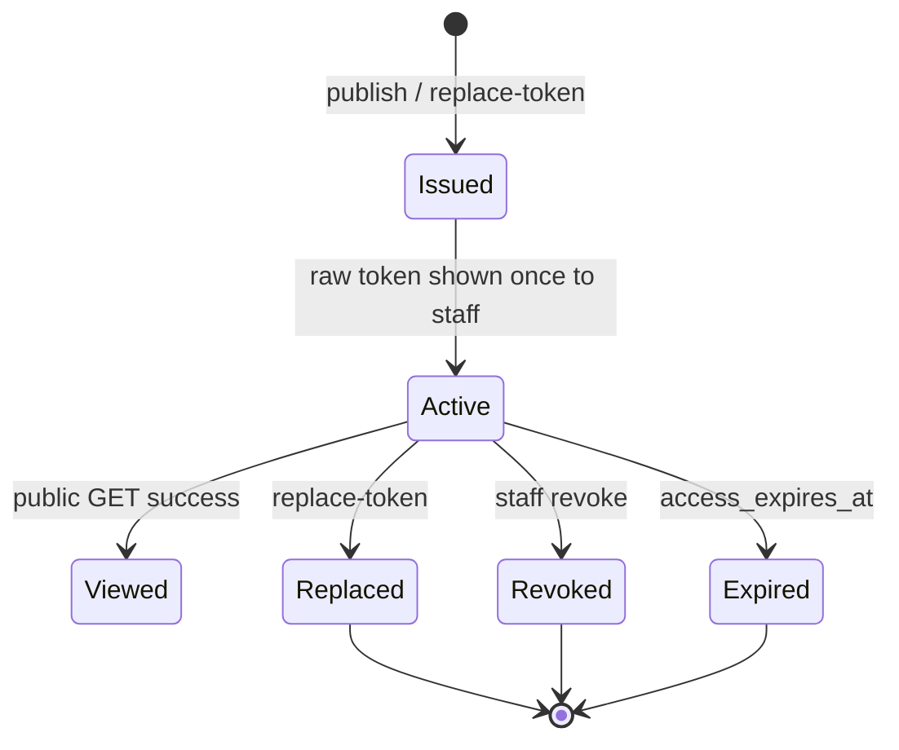

# Phase DE.0 — Public Security and API

**Date:** 2026-07-15
**Status:** Design only — **no routes created in this phase**
**Depends on:** [`TARGET_ARCHITECTURE.md`](./TARGET_ARCHITECTURE.md), [`REVISION_AND_SNAPSHOT_MODEL.md`](./REVISION_AND_SNAPSHOT_MODEL.md)

---

## 1. Threat model (first slice)

| Threat | Mitigation |
|--------|------------|
| Guessable links | High-entropy tokens (≥ 256 bits random); hash at rest |
| Token theft via logs | Never log raw token; URL redact in server logs |
| Enumeration by quote UUID | No public UUID routes; tokens only |
| Revoked/expired data leak | Generic 404 body; no status oracle that returns different shapes for revoke vs missing (same JSON) |
| Org cross-tenant | `organization_id` on publication; lookup includes org consistency checks |
| Internal field leak | Dedicated public serializer; never return `quote_headers` / internal APIs |
| Recalc attacks | No `calculateQuote` on public path |
| Offline scraping | Rate limit by IP (+ optional token bucket) |
| Browser Supabase abuse | **No** anon policies that expose publications; Brain service role only |

---

## 2. Token lifecycle



| Step | Rule |
|------|------|
| Generate | `crypto.randomBytes(32)` (or equiv) → url-safe base64/base62 |
| Store | **SHA-256** (or HMAC with server pepper) of token → `token_hash` UNIQUE |
| Return | Raw token **once** in authenticated publish/replace response only |
| Verify | Lookup by hash; compare with constant-time equality if comparing digests in app memory |
| Revoke | Set `revoked_at` on token and/or publication |
| Replace | Insert new token row; revoke old; same publication/snapshot |
| Expire | `access_expires_at` checked on every public GET |

**Do not** store raw tokens.
**Do not** put tokens on `quote_headers`.

### Relation to `quote_share_links`

Existing scaffold (`eliteos_quote_delivery_foundation.sql`) has `token_hash`, `expires_at`, `revoked_at`, counters — good primitives, missing publication/snapshot/events. Prefer **new** `quote_publication_access_tokens` (or carefully evolve share_links in a later migration with explicit DE migration notes). DE.1 should not activate bare share_links without snapshot binding.

---

## 3. Public-safe DTO (v1 read-only)

Illustrative contract — field names may snake_case in JSON:

```json
{
  "ok": true,
  "estimate": {
    "documentTitle": "Digital Estimate",
    "quoteNumber": "ESF-…-R2",
    "revisionLabel": "R2",
    "publishedAt": "2026-07-15T00:00:00.000Z",
    "pricingValidThrough": "2026-08-15",
    "project": {
      "customerName": "…",
      "projectName": "…",
      "projectAddress": "…"
    },
    "rooms": [
      {
        "name": "Kitchen",
        "summaryLines": ["…"],
        "materialLabel": "Group B — …",
        "colorLabel": "…"
      }
    ],
    "lineItems": [
      { "label": "…", "amount": 1234 }
    ],
    "totals": {
      "estimatedProjectTotal": 12450,
      "currency": "USD",
      "rounding": "integer_usd"
    },
    "notes": ["customer-facing notes only"],
    "disclosures": { "version": "…", "text": "…" },
    "print": { "supported": true }
  },
  "access": {
    "expiresAt": "2026-09-01T00:00:00.000Z"
  }
}
```

**Forbidden in public DTO (redaction list):**

- wholesale / direct / partner rates / $/sf
- margin, markup %, cost
- `internal_ui`, `internal_estimate_math`, `inputSummary`, `lineItemDetails`, `roomLines`, worksheets
- internal notes / worksheet notes / hidden custom lines
- AI diagnostics, takeoff job ids, Gemini payloads
- pricing structure UUIDs, rule ids, organization internal ids (avoid when possible)
- `quote_headers.id` / publication UUIDs (optional opaque public id only if needed)
- service-role keys, auth tokens
- raw email bodies, Graph payloads
- Monday / Moraware / QuickBooks ids
- full calculation_snapshot

Reuse logic from `estimateContentSanitizer.js` / display builder; **do not** return delivery email HTML that embeds unsanitized content.

### Error body (generic)

```json
{ "ok": false, "error": "Not found" }
```

Same for unknown token, revoked, expired, superseded (DE.1). **No** `code: "revoked"` on public responses.

---

## 4. Proposed endpoints

### 4.1 Internal (authenticated)

Base: `/api/digital-estimate`

| Method | Path | Auth | Notes |
|--------|------|------|-------|
| POST | `/publications` | `requireAuth` + head `quote` or `quote_library` + IE operator assert | Body: `{ quoteId, confirm: true }` — server loads revision; optional `revisionId` if publishing non-current later |
| GET | `/publications` | same | `?quoteId=` |
| GET | `/publications/:id` | same | Includes event summary; **not** raw token |
| POST | `/publications/:id/revoke` | same | `{ confirm: true }` |
| POST | `/publications/:id/replace-token` | same | Returns new raw token once |
| POST | `/publications/:id/events/link-copied` | same | Manual share tracking |

Org: derived from auth context — **never** from body.

### 4.2 Public (unauthenticated)

Base: `/api/public-digital-estimate/v1`

| Method | Path | Notes |
|--------|------|-------|
| GET | `/:token` | Rate limited; returns DTO or generic 404 |
| GET | `/:token/print` | Optional; same authz; print-oriented formatting hints only |

Methods **not** allowed: POST/PATCH/DELETE on public prefix in DE.1.

---

## 5. Rate limits

| Surface | Recommendation |
|---------|----------------|
| Public GET | Start from Visualizer pattern (`publicVisualizerRateLimit.mjs`): per-IP sliding window (e.g. 60/min) + per-token soft limit |
| Publish | Staff auth; mild per-user limit to prevent accidental loops |
| 429 body | Generic; include `Retry-After` when safe |

Fail closed when limiter storage unavailable (in-memory OK for single-node Brain; document multi-instance caveat).

---

## 6. Access events

| Event type | When | Metadata (allowed) |
|------------|------|---------------------|
| `published` | Publish success | publicationId, quoteNumber, revisionNumber, actorUserId |
| `link_copied` | Staff action | actorUserId |
| `first_viewed` | First successful public GET | truncated IP hash?, device class — see policy |
| `last_viewed` | Subsequent GETs (throttle e.g. 5–15 min) | same |
| `revoked` | Staff revoke | actorUserId |
| `token_replaced` | Rotate | actorUserId |

### IP / User-Agent policy

- Prefer store **HMAC/hash of IP** + coarse UA family — not raw IP retention long-term.
- Document retention (e.g. 90 days) in migration comments.
- Never echo IP/UA to public clients.
- Do not put estimate content in event metadata.

---

## 7. Data model recommendations (additive)

### 7.1 `quote_publications`

| | |
|--|--|
| **Purpose** | Publication lifecycle header |
| **PK** | `id uuid` |
| **Org** | `organization_id uuid not null` |
| **Relationships** | `source_quote_id → quote_headers(id)`; store `quote_family_root_id`, revision fields denormalized |
| **Immutable** | source ids, published_at, fingerprint, pricing_valid_through (once set), engine versions |
| **Mutable** | `status`, `revoked_at`, `superseded_by`, `access_expires_at` (extend-only policy optional) |
| **RLS** | No anon; staff via Brain service role only |
| **Indexes** | `(organization_id, source_quote_id)`, `(status, access_expires_at)` |
| **Retention** | Keep after revoke for audit; legal hold TBD |
| **Audit** | Events table |

### 7.2 `quote_publication_snapshots`

| | |
|--|--|
| **Purpose** | Frozen customer-safe JSON + internal evidence |
| **PK** | `id uuid` |
| **Org** | `organization_id` |
| **Relationships** | `publication_id` unique 1:1 |
| **Immutable** | `customer_snapshot_json`, `pricing_evidence_json`, hashes |
| **Mutable** | none |
| **Public access** | Never directly; Brain reads after token ok |
| **Indexes** | `publication_id` |

### 7.3 `quote_publication_access_tokens`

| | |
|--|--|
| **Purpose** | Token hashes for access |
| **PK** | `id uuid` |
| **Org** | `organization_id` |
| **Relationships** | `publication_id` |
| **Immutable** | `token_hash`, `created_at` |
| **Mutable** | `revoked_at`, `last_accessed_at`, `access_count` |
| **RLS** | Service role only |
| **Indexes** | **unique** `token_hash`; `(publication_id)` |

### 7.4 `quote_publication_events`

| | |
|--|--|
| **Purpose** | Append-only activity |
| **PK** | `id uuid` |
| **Org** | `organization_id` |
| **Relationships** | `publication_id` |
| **Immutable** | all event rows |
| **Mutable** | none (no update/delete grants) |
| **Indexes** | `(publication_id, created_at desc)`, `(organization_id, event_type, created_at desc)` |

---

## 8. RLS / service-role boundary

| Actor | Access |
|-------|--------|
| Browser (public head) | Calls Brain public HTTPS API only; **no** Supabase service role; anon key only if needed for unrelated authless analytics later — **not** for estimate rows |
| Staff heads | Bearer JWT → Brain internal digital-estimate routes → service role with org checks |
| SQL grants | Revoke anon/authenticated table privileges on publication tables (match delivery foundation posture) |

---

## 9. Abuse / error behavior

| Case | Public response | Staff |
|------|-----------------|-------|
| Bad token | 404 Not found | — |
| Revoked / expired / superseded | 404 Not found | Detail in IE/QL |
| Rate limited | 429 | — |
| Feature flag off | 404 Not found | 404/403 with code |
| Snapshot corrupt | 404 Not found (+ internal log code only) | Alert via logs |

Logging: `event` codes only — never token, never DTO body, never snapshot JSON.

---

## 10. Frontend public head patterns

- Host: **`digital.eliteosfab.com`** (recommended). Do **not** use `estimate.eliteosfab.com` — that hostname is already an Internal Estimate alias (`SYSTEM_BLUEPRINT.md` / CORS allowlist).
- Route shape: `/e/:token` (no query token preferred)
- Print: browser print CSS + optional `/print` view
- On 404: static unavailable page — **no** quote numbers guessed from path
- CORS: add origin to Brain allowlist via `HEAD_URL_DIGITAL_ESTIMATE`
- Do **not** register as Home launcher card for anonymous customers

---

## 11. Compatibility with existing delivery

PDF/email delivery remains on `/api/quote-delivery/*`. Digital Estimate is additive. Do not require share_links for email Phase 1. Do not change Resend templates in DE.1.
