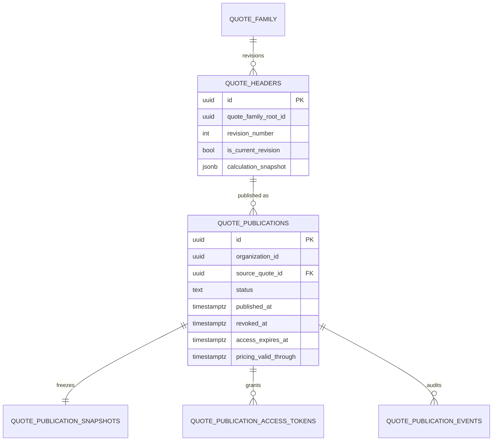

# Phase DE.0 — Revision and Snapshot Model

**Date:** 2026-07-15
**Status:** Design only — **no migrations in this phase**
**Depends on:** [`CURRENT_STATE.md`](./CURRENT_STATE.md), [`TARGET_ARCHITECTURE.md`](./TARGET_ARCHITECTURE.md)

---

## 1. Current revision behavior (as-built)

### 1.1 Row-per-revision

Internal Estimate stores each revision as a **`quote_headers` row** linked by:

- `quote_family_root_id`
- `quote_number_base` + `revision_number` / `revision_label` (e.g. R1, R2)
- `is_current_revision`

Evidence: `eliteos_internal_quote_phase2.sql`, `internalQuoteSave.js`.

### 1.2 Mutability

| Object | Mutable? |
|--------|----------|
| Historical revision row (`is_current_revision=false`) | **No** via normal IE update path |
| Current revision row | **Yes** — `update_existing` recalculates and **replaces** `calculation_snapshot` |
| Metadata PATCH | Status / prepared_by / light fields — **not** snapshot |
| `save_revision` | Creates **new** row; freezes prior current by flipping flag |

### 1.3 Existing snapshot blob

`quote_headers.calculation_snapshot` (jsonb, required):

- Built by server via `calculateQuote` + curated `internal_ui` (CDT, print snapshot, room drafts, etc.)
- Intended as historical pricing evidence when rules later change
- Contains **internal** fields unsafe for customers (use sanitizer)

There is **no** separate `pricing_snapshot` table. Pricing Admin foundation is **not** snapshotted onto the quote today.

### 1.4 Delivery freeze behavior today

Email/PDF path loads the **saved** header snapshot and sanitizes (`estimateSnapshotLoader` → `sanitizeSnapshotForCustomer` → display/PDF). It does not re-price. This is the closest existing “publication freeze” pattern — but it is **not** a durable publication entity, and the underlying current revision can still change afterward (email was a point-in-time render, not an immutable link target).

---

## 2. Target revision behavior

### 2.1 Keep quote_headers revision model

Do **not** invent a parallel quote identity. Digital Estimate **binds** to an existing revision row:

- `source_quote_id` = `quote_headers.id` of the revision being published
- `quote_family_root_id`, `revision_number`, `quote_number` copied for display/audit

### 2.2 Publication immutability rule

> A **published** digital estimate must never change contents because the Internal Estimate was edited, Pricing Admin changed, `calculateQuote` changed, colors moved groups, discounts changed, or another revision was published.

Therefore:

1. Publishing **copies** customer-safe + evidence blobs into **publication snapshot** storage.
2. Public GET reads **only** publication snapshots — never live `quote_headers.calculation_snapshot`.
3. Editing IE after publish affects only future publications / current library row — not active public links (unless product chooses “supersede on edit”, which is **out of DE.1**).
4. Multiple publications per revision are allowed (re-publish, token rotate) but each publication id is immutable content.

### 2.3 Relationship diagram

---

## 3. What must be frozen at publish

### 3.1 Identity & provenance

| Field | Purpose |
|-------|---------|
| `organization_id` | Tenant boundary |
| `source_quote_id` | Exact revision row |
| `quote_family_root_id` | Family link |
| `quote_number` / `revision_label` | Customer + staff display |
| `quote_source` | Must be `internal_quote` for Elite 100 slice |
| `source_quote_fingerprint` | Hash of stored `calculation_snapshot` (+ key header fields) at publish |
| `published_at` | Clock |
| `published_by_user_id` | Actor |
| `calculation_engine_version` | Semver or git-sha of calculator package if available; else explicit constant |
| `terms_disclosure_version` | Terms text version shown |

### 3.2 Customer-safe commercial content

| Field | Source guidance |
|-------|-----------------|
| Customer-safe project identity | account/customer/project/address **customer-allowed** fields only |
| Rooms / areas | Sanitized room summaries (no internal notes) |
| Measurable scope | Customer-visible sq ft / area labels as already shown on print |
| Customer-safe line items | `customerFacing` custom lines only |
| Selected material/color/group | Customer-visible names; **not** $/sf rates |
| Options | Customer-visible options only |
| Exact backend totals | `customer_display_total` / print `finalRounded` and matching breakdown |
| Rounding rule id | e.g. `integer_usd_half_up` matching current `Math.round` display |
| `pricing_valid_through` | Commercial validity date (product-defined; may differ from **access** expiry) |

### 3.3 Pricing / calculation evidence (staff / audit — not public DTO)

Minimum to reproduce / audit later **without** trusting live Admin:

- Full or pruned copy of `calculation_snapshot` as `pricing_evidence_json` (internal)
- `pricing_structure_id` if present
- Material group(s) and rate basis used (`direct` / `wholesale`) as recorded in snapshot
- Totals wholesale/retail as in snapshot (internal only)
- Engine + evidence content hashes

Public serializer **must strip** all of §3.3.

---

## 4. Snapshot storage recommendation

### Hybrid model (recommended)

| Layer | Form | Why |
|-------|------|-----|
| Publication header | Normalized row | Status, org, FKs, expiry, revoke, indexes |
| Access tokens | Normalized row | Hash, revoke, rotate, unique index |
| Events | Normalized append-only | Auditable timeline, retention |
| Customer-safe snapshot | **Immutable JSON document** (jsonb) on snapshot table | Stable public DTO source; easy to version |
| Pricing/calc evidence | **Immutable JSON document** (jsonb), **internal-only** column or separate table with no public select | Reproducibility / disputes |

**Why not purely relational line items for DE.1:** existing IE truth is already snapshot-centric; reconstructing a second normalized public line schema delays the slice without improving customer UX.

**Why not only reuse `quote_headers.calculation_snapshot`:** current revision mutability + internal fields + shared table with staff APIs → leak and silent change risk.

**Why not put token on `quote_headers`:** multi-publication, revoke/replace, and public attack surface belong off the core quote row (scaffold already chose `quote_share_links`).

### Optional evolution of `quote_share_links`

Either:

- **A (preferred for DE.1):** new tables `quote_publications`, `quote_publication_snapshots`, `quote_publication_access_tokens`, `quote_publication_events` — leave unused `quote_share_links` alone or migrate later; or
- **B:** deepen `quote_share_links` with publication_id / snapshot jsonb / events — higher coupling to incomplete scaffold.

Recommend **A** for clarity and RLS/service-role boundaries.

---

## 5. Fingerprints and versioning

| Fingerprint | Algorithm (target) | Stored |
|-------------|-------------------|--------|
| `source_quote_fingerprint` | SHA-256 of canonical JSON of stored calculation_snapshot + quote_number + revision_number | publication |
| `customer_snapshot_hash` | SHA-256 of public-safe JSON | snapshot row |
| `pricing_evidence_hash` | SHA-256 of evidence JSON | snapshot row |

Never treat client-supplied fingerprints as authoritative.

---

## 6. Republish / supersede rules

| Action | Effect |
|--------|--------|
| Publish again (same revision) | New publication id; prior **active** publication may remain or be auto-superseded (product flag; default **manual revoke** in DE.1) |
| Publish newer revision | New publication; optional supersede older actives in family |
| Token replace | Same publication + snapshot; new token hash; old hash revoked; event `token_replaced` |
| Revoke | `revoked_at` set; tokens invalid; public GET → generic 404; snapshot retained for staff audit |

**Superseded:** status `superseded`; link may 404 or show “estimate updated — contact Elite” **without** exposing new content under old token (prefer 404 in DE.1 for simplicity).

---

## 7. Access expiration vs pricing validity

| Clock | Meaning |
|-------|---------|
| `access_expires_at` | Token/link stops resolving (security) |
| `pricing_valid_through` | Commercial statement “prices good through …” shown to customer (content) |

They are **independent**. An unexpired link must still show the **frozen** totals even if Admin prices moved; after `pricing_valid_through`, UI may show a validity banner but **must not** silently reprice (reprice = new publication later).

---

## 8. Immutability rules (normative)

1. No UPDATE to snapshot JSON after publish (except rare admin tombstone flags — not content).
2. No public path calls `calculateQuote`.
3. No public path reads `quote_headers` directly; only via publication join after token verify.
4. Staff “refresh pricing” = create **new** publication after IE save — never mutate old.
5. Deleting a quote family is a retention/legal process; prefer soft-archive + revoke publications.

---

## 9. Recommended additive tables (design only)

Detailed in [`PUBLIC_SECURITY_AND_API.md`](./PUBLIC_SECURITY_AND_API.md) and [`BUILD_PLAN.md`](./BUILD_PLAN.md). Summary:

- `quote_publications`
- `quote_publication_snapshots`
- `quote_publication_access_tokens`
- `quote_publication_events`

**Do not** add public tokens onto `quote_headers` for DE.1.
