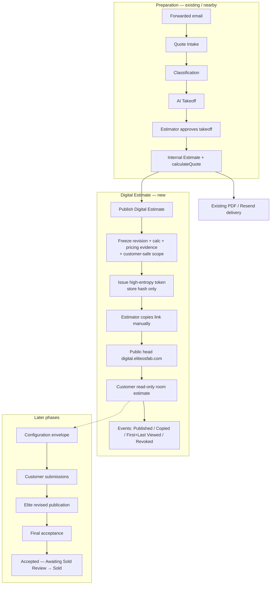
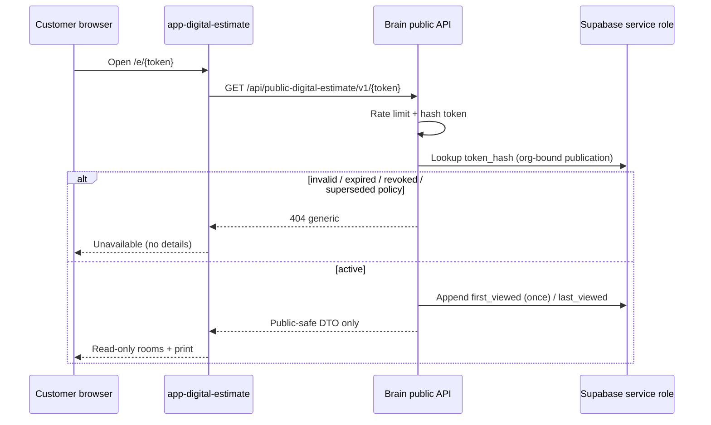

# Phase DE.0 — Elite 100 Digital Estimate — Target Architecture

**Date:** 2026-07-15
**Status:** Architecture blueprint — DE.1 implemented; **DE.1.1 adds private Elite 100 Estimate Studio** for employee publish controls.
**Depends on:** [`CURRENT_STATE.md`](./CURRENT_STATE.md)

---

## 1. Product intent

Connect Quote Intake → AI Takeoff → Internal Estimate → **Elite 100 Estimate Studio (publish)** → **Digital Estimate (public)** while leaving non–Elite 100 and traditional PDF/email paths intact.

**Employee surface (DE.1.1):** Private pilot head `elite100_estimate_studio` (`app-elite100-estimate-studio`, proposed `elite100.eliteosfab.com`). Internal Estimate and Quote Library remain unchanged for the wider team.

**Customer surface:** `app-digital-estimate` (`digital.eliteosfab.com`) — tokenized read-only portal; not in the employee launcher.

**Immediate objective (vertical slice):**
Estimator publishes an **immutable, secure, read-only** digital estimate from a saved Elite 100 quote; customer opens/prints without an account; eliteOS records publish/view/revoke events. PDF remains available; it is no longer the only customer experience.

**Principle:** The **customer browser is never calculation authority**. Publication presents a frozen, server-authored, customer-safe snapshot.

---

## 2. Authority model (preserve)

| Domain | Authority |
|--------|-----------|
| Intake recommendation | AI / classifiers (recommend only) |
| Official takeoff measurements | Estimator-approved takeoff snapshot |
| Professional/commercial scope | Internal Estimate |
| Pricing math | `calculateQuote()` / Brain |
| Customer-permitted choices | Configuration envelope (**later**) |
| What customer saw | **Publication snapshot** |
| Customer choices/requests | Immutable submission snapshots (**later**) |
| Revised commercial offer | Elite publishes new revision/publication |
| Final commercial acceptance | Customer accepts one final revision (**later**) |
| Sold confirmation | Elite employee (`mark-sold` / sold review) |

**Do not** crush these into one giant `quote_status` value. Use separate state domains (§4).

---

## 3. Target end-to-end flow



---

## 4. Separate state domains

| Domain | Owner / store (target) | Examples |
|--------|------------------------|----------|
| Intake state | `quote_intake_cases.status` | received → classified → takeoff… |
| Takeoff state | Takeoff job/result workflow | draft → approved |
| Quote lifecycle | `quote_headers.quote_status` | draft, sent, sold, archived… |
| Publication state | `quote_publications.status` | draft_publish, active, superseded, revoked |
| Customer interaction | `quote_publication_events` + later submission tables | viewed, configured, submitted |
| Acceptance state | future acceptance table | pending, accepted_rev_N |
| Sold / handoff | QL sold + `quote_handoff_documents` | awaiting_sold_review → sold → docs |

Publications **reference** a quote revision; they do not replace Quote Library status.

---

## 5. Head and API boundaries

### 5.1 Recommended heads

| Head | Path | Domain | Auth |
|------|------|--------|------|
| **Internal publication controls** | Extend `app-internal-estimate/` (primary); optional activity in `app-quote-library/` | existing | Staff JWT + head `quote` / `quote_library` |
| **Public Digital Estimate** | **`app-digital-estimate/`** (new) | **`digital.eliteosfab.com`** (`HEAD_URL_DIGITAL_ESTIMATE`) — **not** `estimate.eliteosfab.com` (IE alias) | **Anonymous token** in URL; no account |
| Brain | `backend-core` only | API host | Service role server-side; **no** browser Supabase authority |

Follows existing multi-head pattern (`app-visualizer`, `app-quote`, new Vite head + CORS origin + optional launcher entry for **staff tools only** — public head is not a launcher card).

**Public head slug:** no staff launcher slug required for unauthenticated access. If ops need a staff “preview” surface later, consider authenticated IE embedding instead of exposing admin on the public host.

### 5.2 Recommended Brain modules (new package)

`backend-core/src/digitalEstimate/` (name locked for DE.1+):

| Module | Responsibility |
|--------|----------------|
| `digitalEstimateConfig.mjs` | Feature flags, TTL, rate limits |
| `digitalEstimatePublishService.mjs` | Eligibility, freeze snapshots, create publication |
| `digitalEstimateTokenService.mjs` | Generate token, hash, verify (constant-time), revoke, replace |
| `digitalEstimatePublicSerializer.mjs` | Public-safe DTO only |
| `digitalEstimateAccessService.mjs` | Validate token → return DTO; record view events |
| `digitalEstimateEvents.mjs` | Append-only event writer |
| `digitalEstimateRoutes.js` | Mount internal + public routes |
| `fakeDigitalEstimate*.mjs` + tests | Fake clock / tokens — no network |

Reuse via imports (not copy): sanitizer, display-from-snapshot, print helpers, org helpers, output gate.

### 5.3 Proposed routes (do not create in DE.0)

**Internal (auth + head access `quote` or `quote_library`):**

| Method | Path | Purpose |
|--------|------|---------|
| `POST` | `/api/digital-estimate/publications` | Publish from saved quote revision |
| `GET` | `/api/digital-estimate/publications?quoteId=` | List publications for a quote |
| `GET` | `/api/digital-estimate/publications/:publicationId` | Staff detail + event summary |
| `POST` | `/api/digital-estimate/publications/:publicationId/revoke` | Revoke |
| `POST` | `/api/digital-estimate/publications/:publicationId/replace-token` | Rotate token (optional DE.1+) |
| `POST` | `/api/digital-estimate/publications/:publicationId/events/link-copied` | Record Link Copied/Sent (manual) |

**Public (unauthenticated, rate-limited):**

| Method | Path | Purpose |
|--------|------|---------|
| `GET` | `/api/public-digital-estimate/v1/:token` | Resolve token → public-safe DTO **or** generic 404 |
| `GET` | `/api/public-digital-estimate/v1/:token/print` | Optional print-optimized payload (same redaction) |

**Explicit non-routes:** no public list, no public quote UUID lookup, no PATCH from customer in slice 1.

### 5.4 Relationship to existing heads

```mermaid
flowchart TB
  IE[Internal Estimate] -->|Publish control UI| API_I[/api/digital-estimate/*]
  QL[Quote Library] -->|Show publication activity| API_I
  API_I --> PUB[(quote_publications + snapshots + tokens + events)]
  PUB --> API_P[/api/public-digital-estimate/v1/:token]
  HEAD[app-digital-estimate] --> API_P
  DEL[Existing quote-delivery PDF/email] -.->|unchanged| QH[(quote_headers)]
  PA[Pricing Admin] -.->|does not alter frozen publication| PUB
  QI[Quote Intake / Takeoff] -.->|no coupling in DE.1| PUB
```

---

## 6. Publication flow (staff)

1. Estimator opens **saved** Elite 100 `internal_quote` revision (prefer current, allow explicit historical if product allows).
2. Clicks **Publish Digital Estimate**.
3. Brain validates eligibility (flags, org, source, program, snapshot completeness, CDT/print consistency, not archived).
4. Brain freezes identity: `quote_id`, `revision_number`, `quote_number`, `organization_id`, source fingerprint.
5. Brain freezes calculation + minimum pricing evidence from the **already stored** `calculation_snapshot` (does **not** recalculate for publish unless an explicit “recalc then publish” mode is added later — **default: freeze as saved**).
6. Brain builds customer-safe scope snapshot (serializer).
7. Brain creates publication row + snapshot row + token hash; returns **one-time raw token** + customer URL to UI.
8. Estimator copies link (UI fires `link_copied` event).
9. Estimator may revoke later → public endpoint returns generic not-found; no estimate body.

---

## 7. Access flow (customer)



---

## 8. Event flow

| Event | Trigger | Visibility |
|-------|---------|------------|
| `published` | Successful publish | IE / QL activity |
| `link_copied` | Estimator confirms copy/send manual | Staff |
| `first_viewed` | First successful public resolve | Staff |
| `last_viewed` | Each successful resolve (throttled) | Staff |
| `revoked` | Staff revoke | Staff |
| `token_replaced` | Rotate | Staff |
| `superseded` | Newer publication replaces prior active (policy) | Staff |

Store: append-only `quote_publication_events`. Never store subject lines, raw tokens, or estimate bodies in event metadata.

---

## 9. Later configuration flow (post–read-only slice)

1. Configuration envelope attached to a publication or revision
2. Per-room allowed Elite 100 price groups / colors / options
3. Customer choices → **request snapshot** (immutable)
4. Brain **recalculates** authoritative totals server-side
5. Elite reviews exceptions → publishes **revised** publication
6. Customer accepts final revision → acceptance state
7. Staff Sold confirmation → existing handoff docs

Customer never mutates `quote_headers` pricing directly.

---

## 10. Relationship to Quote Intake / Takeoff / IE / Library / Pricing Admin

| System | Relationship |
|--------|--------------|
| Quote Intake | Upstream preparation; **no** DE coupling in first slice |
| AI Takeoff | Upstream measurements; DE starts from **saved IE quote** |
| Internal Estimate | **Publish control surface** + source of saved revision |
| Quote Library | Activity / status; not system of record for publications |
| Pricing Admin | Future calc authority; **must not** mutate frozen publications |
| Quote Delivery (PDF/email) | Remains; DE is additive channel |

---

## 11. Non-goals for first vertical slice

Customer configuration, autosave, amendments, uploads, signature/acceptance, automated email of the link, auto Takeoff, Takeoff→IE import, pricing refresh on view, sold conversion, Moraware/QB writes, changes to existing PDF delivery, non–Elite 100 quotes.

See [`DO_NOT_TOUCH.md`](./DO_NOT_TOUCH.md) and [`BUILD_PLAN.md`](./BUILD_PLAN.md).
