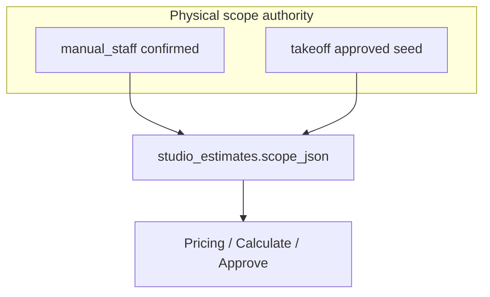

# Studio end-to-end process audit

**Audited main:** `6712ec9e36d379fa6419f8ee74dbd98d5dd6c2ad` (2026-07-24)  
**Evidence standard:** Fact = verified in code/schema/tests. Inference / Recommendation / Unknown labeled.

## Protected golden path (summary)

**Fact:** Workflow sequencing (`3eaacdd`) and published reopen (`3942332`) are ancestors of audited HEAD.

---

## A. Shared mailbox / Quote Intake path

### Trace

`quotes@elitestonefabrication.com` → Microsoft Graph preview/import → `quote_intake_cases` → attachment metadata → Estimate Queue / Command Center → optional automatic Takeoff bootstrap.

### Facts

| Topic | Finding | Evidence |
|-------|---------|----------|
| Mailbox | Server-env mailbox default `quotes@elitestonefabrication.com` (`QUOTE_INTAKE_GRAPH_MAILBOX`) | `quoteIntakeGraphConfig.mjs` |
| Graph client | Read-only GETs; blocks PATCH/PUT/DELETE/move/sendMail | `quoteIntakeGraphClient.mjs` `assertGraphReadOnlyRequest` |
| Preview | `POST /api/quote-intake/mailbox/preview` | `quoteIntakeRoutes.js`, `previewQuoteIntakeMailbox` |
| Import | `POST /api/quote-intake/mailbox/import` requires `confirm:true` | `importQuoteIntakeMailboxMessages` |
| Body persistence | Raw subject/body **not** stored; hashes + `body_char_count` only | `eliteos_quote_intake_v1.sql`, `quoteIntakeGraphNormalize.mjs` |
| Attachment at import | Metadata only; bytes fetched later at Open Estimate | `quote_intake_attachments`, `intakeOpenEstimateService.mjs` |
| Outlook mutation | **None** — messages not marked read/moved/deleted | Graph client guard |
| Auto Takeoff | **Yes, conditional** after import when `QUOTE_INTAKE_AUTOMATIC_TAKEOFF` enabled (default ON if intake API enabled) | `bootstrapIntakeCaseTakeoff` in `intakeAutoBootstrapService.mjs`, wired from `server.js` |
| Soft-fail | Bootstrap failures do not fail import response | `intakeAutoBootstrapService.mjs` |

### Deduplication

| Priority | Key | Evidence |
|----------|-----|----------|
| Primary | `internet_message_id` unique per org | `eliteos_quote_intake_v1.sql` |
| Fallback | `content_hash` when no Message-ID | `computeFallbackContentHash` |
| Preview | `graph_immutable_message_id` scan | `findExistingCase` |

### Step table (mailbox → case)

| Step | Surface | Action | API | Service | Tables | Creates revision? | Can publish? | Can communicate? |
|------|---------|--------|-----|---------|--------|-------------------|--------------|------------------|
| Preview inbox | Sync Inbox modal | Preview | `POST …/mailbox/preview` | `previewQuoteIntakeMailbox` | read Graph only | No | No | No |
| Import messages | Sync Inbox | Confirm import | `POST …/mailbox/import` | `importQuoteIntakeMailboxMessages` | `quote_intake_cases`, attachments, audit | No | No | No |
| Auto bootstrap | (server) | Open + AI queue | internal | `bootstrapIntakeCaseTakeoff` → `openEstimateForIntakeCase` | takeoff links/jobs, `studio_estimates` | No (create draft) | No | No |
| Open estimate | Command Center / Queue | Open | `POST …/cases/:id/open-estimate` | `openEstimateForIntakeCase` | attachments retrieval, `quote_files`, takeoff, studio estimate | May create estimate | No | No |

### Unknowns

- Exact Supabase Storage path template for `ingestQuoteFileFromBytes` not fully traced in this audit pass.
- Sender allowlist for Path A automatic Takeoff is documented as deferred; import currently gates on attachment shape, not sender.

---

## B. Manual estimate path

### Trace

New Estimate → `quote_intake_cases` (`source_type=manual`) + `studio_estimates` draft → Project Details → Manual Scope save → Confirm → Pricing Setup save → Calculate → Approve → Digital Estimate config → explicit Publish.

### Facts

| Step | API | Service | Notes |
|------|-----|---------|-------|
| Create | `POST /api/elite100-estimate-studio/manual-estimates` | `createManualEstimate` | Idempotency-Key required |
| Save draft | `PATCH …/estimates/:id/manual-scope` | `saveManualScopeDraft` | Clears confirmation; may `createRevisionFrom` if was approved |
| Confirm | `POST …/confirm-manual-scope` | `confirmManualScope` | Stamps fingerprint; `ready_to_price` |
| Project details | `PATCH …/project-details` | `updateProjectDetails` | Metadata-only; no calc clear |
| Pricing save | `PATCH …/estimates/:id` | `updateScope` | Pricing geometry |
| Calculate | `POST …/calculate` | `calculate` | Requires confirmed manual scope |
| Approve | `POST …/approve` | `approve` | Requires `confirm:true` + calc fingerprint |

**Family key:** `intake_case_id` on `studio_estimates`.  
**Quote number:** `SE-` + first 8 hex of intake case id (`studioEstimateQuoteNumber`).  
**Active revision:** non-`superseded` row unique per `(organization_id, intake_case_id)`.

Evidence: `studioManualEstimateService.mjs`, `studioEstimateService.mjs`, `eliteos_studio_estimates_v1.sql`, FEATURE_DECISIONS §171–§176.

### Step table (manual path)

| Step | Surface | Action | API | Service | Primary tables | Before → After | Rev? | Comm? | Pub? | Failure |
|------|---------|--------|-----|---------|----------------|----------------|------|-------|------|---------|
| New Estimate | Studio | Create | `POST …/manual-estimates` | `createManualEstimate` | `quote_intake_cases`, `studio_estimates` | none → draft rev 1 | creates | no | no | Idempotent replay / 4xx |
| Project Details | ProjectDetailsPanel | Save metadata | `PATCH …/project-details` | `updateProjectDetails` | `studio_estimates.scope_json` | draft → draft | no | no | no | 502/503/504 retry UI |
| Manual Scope save | ManualPhysicalScopeEditor | Save | `PATCH …/manual-scope` | `saveManualScopeDraft` | scope_json | unconfirmed | maybe if was approved | no | no | Transient recovery |
| Confirm scope | ManualPhysicalScopeEditor | Confirm | `POST …/confirm-manual-scope` | `confirmManualScope` | confirmation stamps | confirmed / ready_to_price | no | no | no | Validation 4xx |
| Pricing Setup | EstimateScopePanel | Save pricing | `PATCH …/estimates/:id` | `updateScope` | scope commercial fields | priced | maybe | no | no | Fingerprint rules |
| Calculate | EstimateScopePanel | Calculate | `POST …/calculate` | `calculate` | `calculation_snapshot_json` | calculated | no | no | no | Gated if unconfirmed |
| Approve | EstimateScopePanel | Approve | `POST …/approve` | `approve` | `approval_json` | approved | no | no | no | Requires confirm + calc |
| DE config | EstimateDigitalEstimatePanel | Configure | `GET …/digital-estimate` | `assessReadiness` | read | ready flags | no | no | no | Read-only |
| Publish | EstimateDigitalEstimatePanel | Publish | `POST …/digital-estimate/publish` | `publish` | publications + freeze | published | no | no* | **yes** | Explicit only; *no auto email |

Publication blockers (Fact): estimate not approved; readiness gates; feature flag; missing DE config — see `assessReadiness` / publish service.

---

## C. AI Takeoff path

### Trace

Intake case with supported PDF → takeoff link/job (automatic bootstrap and/or Open Estimate) → AI generation → estimator review (AI Takeoff head iframe) → Approve Takeoff → Estimate Scope seed → Pricing → Calculate → Approve → Publish.

### Facts

| Topic | Finding | Evidence |
|-------|---------|----------|
| Job create/reuse | `openEstimateForIntakeCase` / `createTakeoffWorkspace`; link table `quote_intake_takeoff_links` with idempotency key | `intakeOpenEstimateService.mjs` |
| Studio gate | `GET …/intake-cases/:caseId/estimate` → `getOrCreateForCase` → `refreshTakeoffGate` | `studioEstimateService.mjs` |
| Seed | Empty scope after Takeoff approval seeds rooms; commercial fields preserved on refresh | `refreshScopeFromTakeoff` |
| Manual vs Takeoff | Confirmed manual with no `takeoffJobId` skips Takeoff gate | early return in `refreshTakeoffGate` |
| Overwrite | Approved Takeoff change after seeded scope sets `staleReason`; after approval may revise | `refreshTakeoffGate` |
| Iframe | Studio embeds AI Takeoff head; `postMessage` approval signal | `EstimateTakeoffWorkspace.tsx`, AI Takeoff consolidated review |
| postMessage origin | **Inference / risk:** Takeoff posts with origin `"*"`; parent must validate | AI Takeoff `ConsolidatedTakeoffReview` (flagged) |

### Step table (Takeoff path)

| Step | Surface | Action | API / mechanism | Service | Tables | Before → After | Rev? | Comm? | Pub? | Failure |
|------|---------|--------|-----------------|---------|--------|----------------|------|-------|------|---------|
| Import/open | Inbox / CC | Import or Open | mailbox import / open-estimate | bootstrap / `openEstimateForIntakeCase` | cases, files, takeoff links/jobs, studio estimate | case → takeoff linked | draft create | no | no | Soft-fail bootstrap |
| AI processing | Takeoff head | Generate | Takeoff job APIs | takeoff generation | job/results | queued → ready | no | no | no | Retry / manual fallback |
| Estimator review | Takeoff iframe | Edit/approve UI | Takeoff workspace | takeoff services | results | reviewed | no | no | no | — |
| Approve Takeoff | Takeoff | Approve | Takeoff approval API | approval gate | job status | approved geometry | no | no | no | Gate tests |
| Seed scope | Studio | Open / refresh | GET estimate / refresh-from-takeoff | `refreshTakeoffGate` / `refreshScopeFromTakeoff` | `studio_estimates` | scope seeded | maybe | no | no | Stale reason / revise |
| Pricing→Publish | Studio | Same as manual B | same | same | same | same | same | no | explicit | same |

**Race protections (Fact/Inference):** Idempotent takeoff links; unique active estimate per case; panel `onActiveEstimateChange` after revise. **Risk:** postMessage origin `*` (AUDIT-005).

---

## D. Publication path

### Trace

Approved estimate → DE configuration → explicit `POST …/digital-estimate/publish` → publication row + frozen snapshots → staff-safe recovered `customerUrl` → customer page → activity events → explicit replace/revoke.

### Facts

| Topic | Finding | Evidence |
|-------|---------|----------|
| Publish | Explicit confirm required; feature-flagged | `studioEstimateDigitalEstimateService.publish` |
| Snapshot | Customer snapshot + pricing evidence freeze | `buildPublicationFreezePayloads` |
| Active selection | Family-active publication via intake case / quote list | `listActivePublicationsForFamily`, `assessReadiness` |
| Link recovery | AES wrap decrypt server-side; URL to staff only | `recoverStaffPublicationLinkMeta` |
| Reopen | Publication summary on estimate GET + workflow `published` stage | `getWorkspacePublicationSummary`, `buildStudioWorkspaceWorkflow`, `EstimatePublicationSummary.tsx` |
| Load mutations | GET readiness / summary do **not** publish/replace/revoke | return flags `published:false` etc. on summary helper |

### Step table (publication)

| Step | Surface | Action | API | Service | Tables | Before → After | Rev? | Comm? | Pub? | Failure |
|------|---------|--------|-----|---------|--------|----------------|------|-------|------|---------|
| Readiness | DE panel / GET estimate | Load | `GET …/digital-estimate` / estimate GET summary | `assessReadiness` / `getWorkspacePublicationSummary` | publications (read) | flags only | no | no | **no** | 5xx refresh safe |
| Publish | DE panel | Explicit publish | `POST …/digital-estimate/publish` | `publish` | publication + freeze payloads | active pub | no | no* | **yes** | Validation blockers |
| Recover URL | Publication summary / Live DE | View/copy | publication GET / Live DE | `recoverStaffPublicationLinkMeta` | tokens (server decrypt) | URL to staff | no | no | no | Auth/org scoped |
| Customer view | Public DE page | Open link | public customer routes | public DE services | snapshot read + view events | viewed flags | no | no | no | Token auth |
| Replace | DE / Live DE | Explicit replace | `POST …/replace-token` (or replace flow) | replace | new token / historical prior | replaced | no | no | **yes** | Explicit |
| Revoke | DE / Live DE | Explicit revoke | `POST …/revoke` | revoke | status revoked | revoked | no | no | **yes** | Explicit |

\*Publish does not imply automatic email/notification in Studio golden path (Fact from delivery-safety posture; gate scenarios 38–39).

---

## E. Review Request path

### Trace

Customer on Digital Estimate → review request → Studio Review Requests / Command Center “Customer submitted” → estimator opens estimate with `openTarget=review` → resolve/republish via explicit actions.

### Facts

| Topic | Finding | Evidence |
|-------|---------|----------|
| Model | Amendment/review request repository; linked by `publication_id` | `studioReviewRequestService`, amendment repo |
| Relation | Filtered against active publication IDs in readiness | `assessReadiness` reviewRequests filter |
| Command Center | Workflow `Customer submitted` → openTarget `review` | `studioEstimateQueueWorkflow.mjs`, `studioCommandCenterViewModel.mjs` |
| Non-acceptance | Review path rejects economic field spoofing; not auto-sold | Review Request part3 tests |

### Step table (review request)

| Step | Surface | Action | API | Relation | Rev? | Changes publication? |
|------|---------|--------|-----|----------|------|----------------------|
| Customer submit | Public DE | Request changes | public review submit | → publication_id | no | no (creates RR) |
| List open | Review Requests / CC | View | `/review-requests` / queue | filtered vs active pubs | no | no |
| Open | Studio | openTarget=review | estimate open | active revision for family | no | no |
| Resolve / revise | Studio | Explicit | resolve + estimate mutate | may revise then republish | maybe | only via explicit publish/replace |

**Fact:** Resolving a Review Request does not by itself revoke or replace a publication. Historical publications can still have attached request history; readiness filters against active publication IDs.

---

## F. Revision-after-publication path

### Trace

Published revision → price-affecting scope edit → `createRevisionFrom` (old status `superseded`, new revision N+1) → prior publication remains until explicit replace/revoke → new confirm/calc/approve → explicit replace.

### Facts

| Topic | Finding | Evidence |
|-------|---------|----------|
| Creator | `SupabaseStudioEstimateRepository.createRevisionFrom` via `revisePreservingApprovedSnapshot` | `supabaseStudioEstimateRepository.mjs`, `studioEstimateService.mjs` |
| Panel sync | `onActiveEstimateChange` + `scopeRefreshKey` | `EstimateTakeoffWorkspace.tsx` |
| Prior approval | `previousRevisionSummary` / historical labels | workflow + manual safe view |
| Prior publication | Historical if revision mismatch; may still be “active” link until replaced | `studioPublicationSummary.mjs` |
| Precedence | Stale new revision workflow wins over historical publication | `buildStudioWorkspaceWorkflow` tests T17 |

### Step table (revision after publish)

| Step | Surface | Action | Service | Before → After | Active pub? | Workflow precedence |
|------|---------|--------|---------|----------------|-------------|---------------------|
| Price-affecting edit | Scope / Manual | Save | `createRevisionFrom` via revise helpers | rev N superseded → rev N+1 active | Prior may remain active URL | New revision workflow |
| Reconfirm/calc/approve | Studio | Explicit | confirm/calculate/approve | N+1 approved | Unchanged until replace | Studio stages |
| Replace publication | DE | Explicit | replace/publish | New freeze on N+1 | New current; old historical | Publication summary current |

**Disagreement risk:** Stale panel holding rev N id (AUDIT-002). Old publication remains customer-reachable until replace/revoke (intentional — AUDIT-009).

---

## G. Metadata-only path

| Edit | Clears calc? | Clears approval? | Creates revision? | Mutates publication? |
|------|--------------|------------------|-------------------|----------------------|
| Project name/address/notes via project-details | No | No | No | No |
| Same fields via general scope if pricing fingerprint unchanged | No (metadata-only branch) | No | No | No |
| AD identity change on approved estimate | May revise (identityChanged) | Via revision | Yes if approved | No auto |

Evidence: `updateProjectDetails`, `pricingScopeFingerprint` excluding `PROJECT_METADATA_SCOPE_KEYS`, FEATURE_DECISIONS §174.

---

## H. Future Sold Job boundary

| Topic | Current state | Evidence |
|-------|---------------|----------|
| Queue “Sold” | Display-compatible placeholder in queue workflow vocabulary | `studioEstimateQueueWorkflow.mjs` |
| Quote Library sold | Legacy `quote_headers` status / handoff checklists | Quote Library handoff payloads |
| QuickBooks / Moraware | Staff checklist / linkage labels; no automatic writeback from Studio publish | Live DE QB consistency tests; handoff docs |
| Digital Estimate acceptance | Review/submit ≠ sold | Review Request tests |

**Recommendation:** Sold Job remains a future explicit handoff surface; do not couple to publication load/refresh.

---

## Convergence: Manual vs AI

**Fact:** `physicalScopeSource` / `estimateOrigin` are server-owned; client cannot forge confirmation (`stripClientManualAuthority`).  
**Fact:** Confirmed manual estimates without Takeoff job skip Takeoff approval gate for calculate/approve.  
**Risk:** Takeoff refresh after approval can create a new revision; panels must switch to new estimate id (mitigated by PR #81 sync).

---

## Golden path safety verdict (process)

**Fact / Inference:** The protected golden path is architecturally usable for continued production use during cleanup, provided active-revision sync and publication-aware reopen remain in place. No automatic publish/email/sold path was found on Studio GET/load/refresh/copy-link flows in this audit.
