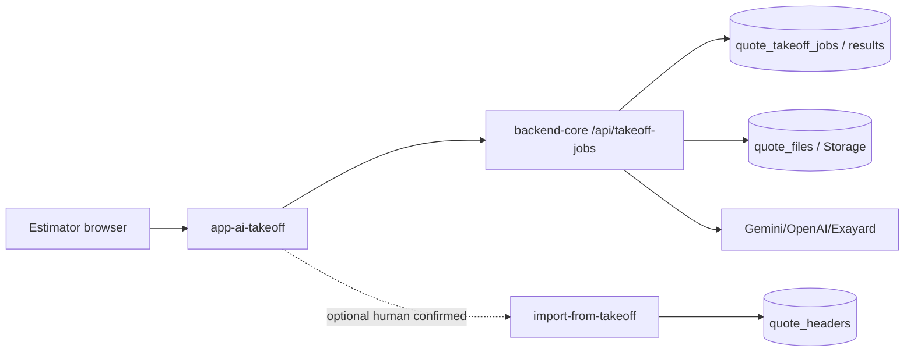
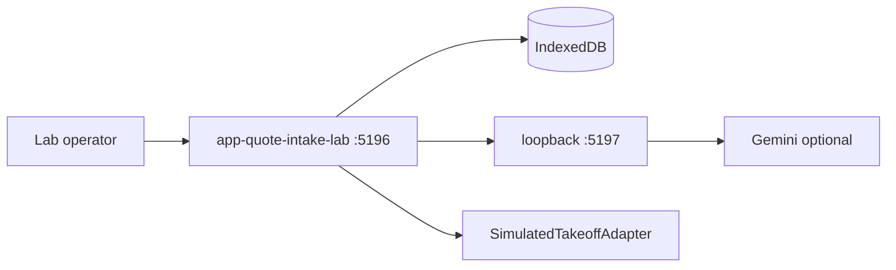

# Phase 6P.0 — Live Promotion Architecture Boundary

**Date:** 2026-07-15
**Status:** Documentation and repository analysis only — **no implementation**
**Phase:** 6P.0
**Related:** [`PHASE_6P_0_TAKEOFF_INTEGRATION_MAP.md`](./PHASE_6P_0_TAKEOFF_INTEGRATION_MAP.md) · [`PHASE_6P_0_MICROSOFT_GRAPH_PLAN.md`](./PHASE_6P_0_MICROSOFT_GRAPH_PLAN.md) · [`PHASE_6P_0_AUTOMATIC_TAKEOFF_POLICY.md`](./PHASE_6P_0_AUTOMATIC_TAKEOFF_POLICY.md) · [`PHASE_6P_0_DATA_AND_SECURITY_BOUNDARY.md`](./PHASE_6P_0_DATA_AND_SECURITY_BOUNDARY.md) · [`PHASE_6P_0_IMPLEMENTATION_PLAN.md`](./PHASE_6P_0_IMPLEMENTATION_PLAN.md) · [`DO_NOT_TOUCH.md`](./DO_NOT_TOUCH.md) · [`PHASE_4_TAKEOFF_BOUNDARY.md`](./PHASE_4_TAKEOFF_BOUNDARY.md)

---

## 0. Product objective

Promote the proven Quote Intake Lab workflow into the **existing live AI Takeoff head** so sales can forward quote requests to:

`quotes@elitestonefabrication.com`

For **trusted, qualifying** forwards, eliteOS automatically starts the **existing** AI Takeoff pipeline **before** an estimator opens the case.

> **AUTOMATE PREPARATION, NOT APPROVAL.**

Human approval remains mandatory before accepting the reviewed takeoff, generating pricing, creating an Internal Estimate, creating a Quote Library record, communicating with the customer, or sending a quote.

**Pilot disables:** pricing, Internal Estimate, Quote Library promotion, outbound customer email.

---

## 1. Working tree (Phase 6P.0 investigation)

| Check | Result |
|-------|--------|
| Branch | `quote-intake-lab-phase-4b4` |
| `git status --short` | Clean (empty) at investigation start |
| `git diff --check` | Clean |
| Phase 4B.5A | Already committed (`72771f6 Add offline synthetic takeoff benchmark suite`) — preserved |

No application source, migrations, packages, lockfiles, or env files were modified in 6P.0.

---

## 2. Core principle and authorization update

### 2.1 Principle

| Allowed automatic | Never automatic in pilot |
|-------------------|---------------------------|
| Mailbox import (when gates pass) | Customer email |
| Classification / field extraction | Pricing |
| Trusted automatic Takeoff job start | Internal Estimate creation |
| Queue status updates | Quote Library writes |
| Internal audit events | Approving takeoff on behalf of estimator |

### 2.2 Newly authorized (bounded) Takeoff host

Phase 6P.0 authorizes a **tightly bounded** future refactor of:

- `app-ai-takeoff/**` — add protected Estimator Queue **tab/view** without changing the default workbench
- `backend-core/src/takeoff/*` — **only** when needed to expose a stable **internal service seam** for intake-owned Takeoff submission
- New namespaced `backend-core/src/quoteIntake/**` (name TBD) — intake APIs, Graph connector, automation decisions

Previous lab phases treated `app-ai-takeoff` as do-not-touch for lab isolation. Live promotion **explicitly** allows the Estimator Queue host and TakeoffAdapter seam, subject to:

1. Default Takeoff upload → generate → review → approve → import UI remains available and must not regress.
2. Queue is pilot-gated (feature flag + allowlist/role + server auth).
3. Intake never calls `POST /api/internal-quotes/import-from-takeoff`.
4. No drive-by changes to Internal Estimate UI or quote persistence.

See [`DO_NOT_TOUCH.md`](./DO_NOT_TOUCH.md) for the updated careful-zone language.

---

## 3. Current architectures (inspected)

### 3.1 Live AI Takeoff (production)

```
Sales / estimator
    │
    ▼
app-ai-takeoff (takeoff.eliteosfab.com, Vite :5186 locally)
  TakeoffLabApp.tsx  — single SPA, NO React Router
  Deep link: ?takeoffJobId=<uuid>
    │  Bearer JWT + requireHeadAccess("ai_takeoff")
    ▼
backend-core
  takeoffWorkspaceRoutes.js  →  /api/takeoff-jobs/*
  quoteFileService           →  /api/quote-files/*
  takeoffWorkspaceService    →  quote_takeoff_jobs / quote_takeoff_results
  takeoffGenerationOrchestrator + takeoffExtractionService
       Pass1 inventory → Pass2 evidence → Pass3 extraction
       → computeTakeoffMeasurements (authoritative)
       → validate / QA / approval gates
    │
    │  OPTIONAL human-confirmed path (NOT takeoff routes)
    ▼
POST /api/internal-quotes/import-from-takeoff
  → calculateQuote + persistQuoteSubmission → quote_headers
```

**Inspected entry points:**

| Area | Paths |
|------|-------|
| Frontend | `app-ai-takeoff/src/main.tsx`, `TakeoffLabApp.tsx`, `components/*`, `lib/api.ts` |
| Backend routes | `backend-core/src/takeoff/takeoffWorkspaceRoutes.js` |
| Services | `takeoffWorkspaceService.mjs`, `takeoffGenerationOrchestrator.mjs`, `takeoffExtractionService.mjs`, `takeoffProcessOrchestrator.mjs` |
| Pure calc/gates | `takeoffMeasurementCalc.mjs`, `takeoffValidator.mjs`, `takeoffApprovalGate.mjs`, `takeoffQaGate.mjs` |
| IE import | `backend-core/src/quotes/internalQuotesApi.js`, `internalQuoteTakeoffImport.mjs` |
| Auth | `requireAuth`, `requireHeadAccess("ai_takeoff")`, `EOS_HEAD_SLUGS` includes `ai_takeoff` |
| Tables | `quote_takeoff_jobs`, `quote_takeoff_results`, `quote_files`, `quote_file_events`, bucket `eliteos-quote-files` |

### 3.2 Local Quote Intake Lab (isolated)

```
Manual .eml / paste
    │
    ▼
app-quote-intake-lab (:5196 Vite + :5197 loopback intel server)
  IndexedDB persistence (local only)
  Classification (simulated / live Gemini — text/metadata only)
  TakeoffAdapter (SimulatedTakeoffAdapter / LiveGeminiTakeoffAdapter)
  Deterministic lab measurement + review workspace
  Offline synthetic benchmark corpus (Phase 4B.5A)
```

**Not production-integrated.** No Graph connector. No shared estimator queue. No `quote_intake_*` production tables.

Lab statuses (`src/domain/statuses.mjs`): `qil_received` … `qil_failed`, plus takeoff sub-statuses `qil_takeoff_*`.

Lab TakeoffAdapter (`src/takeoff/takeoffTypes.mjs`): `{ run, getRun, listRuns }`.

---

## 4. Proposed combined architecture

```
Salesperson deliberately forwards
  To: quotes@elitestonefabrication.com
  Subject: [QIL TAKEOFF] Customer — Project
  Body: Program: Elite 100 (+ optional structured block)
  Attachment: direct PDF(s)
        │
        ▼
Microsoft Graph (Mail.Read only, server-side)
  Manual Sync (pilot) → import once
        │
        ▼
backend-core Quote Intake service (NEW, namespaced)
  validate + dedupe + automation gates
  classification / extraction
  PATH A: ProductionTakeoffAdapter → create workspace + generate-ai-draft
          → quote_intake_takeoff_links
  PATH B: manual review (no Takeoff job)
        │
        ▼
app-ai-takeoff — Estimator Queue TAB (NEW, pilot-gated)
  default tab = existing workbench (UNCHANGED)
  queue → deep-link ?takeoffJobId=… for review
        │
        ▼
Estimator reviews / corrects / approves on EXISTING Takeoff UI
        │
        ✕  Pilot: NO import-from-takeoff, NO pricing, NO customer email
```

---

## 5. Recommended queue host strategy

| Option | Summary | Verdict |
|--------|---------|---------|
| A. `/intake` route requiring React Router | Touches boot path of a router-free SPA | Higher risk |
| **B. Estimator Queue tab; default workbench unchanged** | State/query-param view switch; pilot gated | **Recommended** |
| C. Separate deployed head | New Vercel app + cross-head UX | Clean long-term; overkill for pilot |

**Recommendation: Option B (+ query-param deep links).**

- Default view remains the existing upload / inbox / review workbench.
- Pilot users see an **Estimator Queue** control (topbar slot or secondary tab).
- Non-pilot users never see it; server rejects queue API access.
- Deep links:
  - Existing: `?takeoffJobId=<uuid>`
  - Additive: `?view=intake` and/or `?intakeCaseId=<uuid>` (no full React Router required initially)
- Existing Takeoff job review remains the authoritative review surface for the first live proof.

---

## 6. Architecture diagrams

### 6.1 Current live Takeoff



### 6.2 Current local Quote Intake Lab



### 6.3 Proposed combined (pilot)

```mermaid
flowchart TB
  Sales[Sales forward] --> MBOX[quotes@ mailbox]
  MBOX --> Graph[Graph Mail.Read]
  Graph --> QI[Quote Intake APIs]
  QI --> QITables[(quote_intake_*)]
  QI -->|Path A gates pass| Adapter[ProductionTakeoffAdapter]
  Adapter --> TO[Existing takeoff services]
  TO --> Jobs[(quote_takeoff_jobs)]
  QI --> Links[(quote_intake_takeoff_links)]
  Est[Pilot estimator] --> Queue[Estimator Queue tab]
  Queue --> QI
  Queue -->|deep link| Review[Existing Takeoff review]
  Review --> Jobs
  Review -.->|PILOT DISABLED| IEBlock[import-from-takeoff]
```

### 6.4 Trusted automatic path vs manual-review path

See [`PHASE_6P_0_AUTOMATIC_TAKEOFF_POLICY.md`](./PHASE_6P_0_AUTOMATIC_TAKEOFF_POLICY.md).

### 6.5 Data ownership & kill-switch boundaries

See [`PHASE_6P_0_DATA_AND_SECURITY_BOUNDARY.md`](./PHASE_6P_0_DATA_AND_SECURITY_BOUNDARY.md).

---

## 7. Target business flow (condensed)

1. Salesperson receives customer request.
2. Forwards to `quotes@elitestonefabrication.com` with `[QIL TAKEOFF]` marker.
3. Optional structured intake block; unknown fields blank.
4. Microsoft ingestion imports (manual Sync in first proof).
5. eliteOS validates sender, message, attachments, dedupe, automation gates.
6. Classification extracts business fields.
7. If trusted gates pass → submit PDF through existing Takeoff pipeline automatically.
8. Estimator Queue shows processing / ready / manual / failed.
9. Estimator reviews completed takeoff (no Start Takeoff click for Path A).
10. Estimator approval mandatory.
11. IE / Quote Library / pricing / outbound email remain disabled in pilot.

---

## 8. Forwarding contract (initial pilot)

**Subject:**

```text
[QIL TAKEOFF] Customer Name — Project Name
```

**Optional body block:**

```text
Program: Elite 100
Customer:
Project:
Requested color:
Price group:
Edge profile:
Sink cutouts:
Backsplash:
Salesperson:
Notes:
```

**Attachment mode:** Normal Outlook/Exchange forward where PDFs remain **directly attached**.

**Deferred:** “Forward as attachment” / nested `.eml` / Outlook item attachments — later enhancement unless existing code already supports them safely (it does not today).

---

## 9. Microsoft setup (as provided — do not print secrets)

| Item | Value / status |
|------|----------------|
| Shared mailbox | `quotes@elitestonefabrication.com` |
| Human access | Verified |
| Entra app | `eliteOS Quote Intake Lab` (single-tenant) |
| Auth | Client-credential secret created (value never logged/copied into docs) |
| Exchange | Service principal + Application `Mail.Read` RBAC |
| Scope | **Only** `quotes@elitestonefabrication.com` (`InScope=True`); Hunter `InScope=False` |
| Mail.Send | **None** |
| Connector in product | **Not implemented yet** |

---

## 10. Live MVP acceptance test (exact target)

1. Approved salesperson forwards synthetic message to `quotes@…`
2. Subject begins `[QIL TAKEOFF]`
3. Body declares `Program: Elite 100`
4. One supported synthetic PDF directly attached
5. Pilot estimator opens Estimator Queue in live Takeoff head
6. Estimator clicks **Sync mailbox** (first pilot)
7. Message imported once
8. Central intake case created
9. Classification/extraction runs
10. Trusted automation gates pass
11. Existing Takeoff job created automatically
12. No estimator click to start Takeoff
13. Queue shows queued/processing
14. Pipeline completes
15. Queue shows ready for review
16. Estimator opens existing Takeoff review
17. Estimator verifies result
18. Another authorized estimator sees same case
19. Non-pilot cannot access queue
20. Re-sync does not duplicate case or job
21. Hunter mailbox remains inaccessible
22. No move/delete/mark-read
23. No customer email
24. No pricing
25. No IE / Quote Library record
26. Existing Takeoff users/upload behavior unchanged

---

## 11. Rollback (summary)

- Kill Graph sync + automatic Takeoff flags
- Hide queue tab
- Preserve audit/history
- Stop new intake jobs without interrupting existing Takeoff users or in-flight jobs
- Rotate/remove Graph secret; remove Exchange RBAC if abandoning
- Drop `quote_intake_*` tables only via deliberate cleanup migration
- Never delete production Takeoff job/result rows as part of intake rollback

Full detail: [`PHASE_6P_0_IMPLEMENTATION_PLAN.md`](./PHASE_6P_0_IMPLEMENTATION_PLAN.md) § rollback.

---

## 12. Risks and unresolved questions

| Risk / question | Notes |
|-----------------|-------|
| Vercel `waitUntil` + 300s ceiling | Multi-pass Gemini may approach timeout; monitor closely |
| `quote_id` nullability on takeoff tables | Workspace already supports null quote linkage; confirm all envs migrated |
| Intake-owned vs shared Storage bucket | Prefer reusing `eliteos-quote-files` with intake metadata + audit vs new bucket (open) |
| Pilot allowlist mechanism | Env flag + `user_head_access` extension vs dedicated table (open; recommend env + head access first) |
| System actor identity for automation | Need distinct service/system user or audited `created_by_system` flag |
| Multi-file plan packages | Pilot policy = manual review when ambiguous |
| Nested `.eml` | Explicitly deferred |
| Real-plan transmission flag | Must stay **off** until separate approval after synthetic E2E |
| Classification model sharing vs Takeoff providers | Keep contracts separate; share HTTP client patterns only |
| Whether to introduce React Router later | Prefer query-param views for 6P.3 |

---

## 13. Exact do-not-touch (still prohibited in 6P.0 and pilot)

- `app-internal-estimate/**`
- `app-quote-library/**`, Quote Library APIs
- `POST /api/internal-quotes/import-from-takeoff` and detach
- Pricing calculate/persist authority paths for intake automation
- `quoteDelivery` / customer email send
- Monday / Moraware / QuickBooks
- Home Launcher registration of a separate lab card (unless later approved)
- Real customer plan transmission before explicit flag approval
- Any `Mail.Send` / mailbox mutation Graph permissions

**6P.0 itself:** documentation only — no Graph calls, no mailbox reads, no Gemini, no migrations, no commits.
