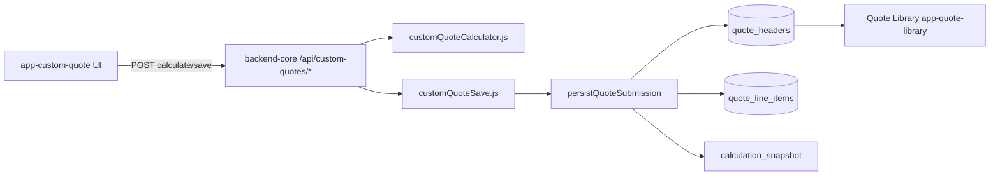

# Custom Quote Tool — implementation plan

**Status:** Foundation pass (2026-06-11)  
**Head:** `app-custom-quote` · slug `custom_quote` · `quote_source = custom_quote`  
**Audience:** Engineers and operators wiring off-program / non-Elite-100 material quotes.

---

## 1. Product intent

- **Custom Quote Tool** is a **separate ESF-only internal head** — not a tab inside Internal Estimate.
- Use for **off-program / non-Elite-100** material quotes only.
- **Not** exposed to dealers, partners, homeowners, or public quote users.
- Every saved quote lands in **Quote Library** via the shared `quote_headers` canonical record.
- **Dealer Tool** (AI takeoff-first) remains **documented only** — not implemented in this pass.

---

## 2. Data flow



1. Estimator completes worksheet in **Custom Quote** head (auth + `custom_quote` head access).
2. **Calculate** calls `POST /api/custom-quotes/calculate` — Brain returns authoritative math + warnings.
3. **Save** calls `POST /api/custom-quotes/save` — Brain persists via `persistQuoteSubmission` with `quote_source: custom_quote`, `skipMondaySync: true` until Monday routing is configured.
4. **Quote Library** lists/filters the row like any other source; open action points to Custom Quote head (not Internal Estimate).

---

## 3. Persistence model

| Artifact | Role |
|----------|------|
| `quote_headers` | Canonical quote row (`quote_source = custom_quote`, `grand_total = sellPrice`, `estimated_sqft = projectSqft`) |
| `quote_line_items` | Material, freight, fabrication/shop, optional install/other lines |
| `calculation_snapshot` | Frozen pricing inputs + calculator outputs at save time |
| `quote_status_history` / `quote_calculation_audit` / `quote_forecast_events` | Via existing `persistQuoteSubmission` patterns |

**Not used:** `processInternalQuoteSave` (Internal Estimate revision/ESF numbering path). Custom Quote v1 uses create-only save.

**Optional future table:** `quote_custom_quote_details` (worksheet JSON) — **not created** in foundation pass; snapshot on header is sufficient for v1.

---

## 4. Backend routes

| Method | Path | Auth |
|--------|------|------|
| POST | `/api/custom-quotes/calculate` | `requireAuth()` + `requireHeadAccess("custom_quote")` + internal operator guard |
| POST | `/api/custom-quotes/save` | Same |

No public or partner routes. Dealer-safe head sets **exclude** `custom_quote`.

---

## 5. Pricing model (markup/uplift — not gross-margin math)

### 5.1 Two square footage concepts (do not conflate)

- **projectSqft** — actual measured project scope (room/shape measurements, or a
  manual fallback when no room measurements exist). Drives **fabrication/install/shop**
  cost (the labor ESF performs).
- **slab/yield sqft** — net usable area per slab after edge trim, used to size the
  **material order** (how many slabs ESF must buy). Drives **material** cost.

Material/freight follow slab coverage; fabrication follows projectSqft. Never
multiply every cost line by the same square footage.

### 5.2 Slab yield

```
netSlabWidthInches  = slabWidth  - 2      (skipped when slabSqft override is used)
netSlabHeightInches = slabHeight - 2
usableSlabSqftPerSlab = (netW × netH) / 144   OR  slabSqft override (used as-is)

wasteFactor = 1.20 (default backend constant)
wasteAdjustedProjectSqft = projectSqft × wasteFactor

enteredAvailableSlabSqft = usableSlabSqftPerSlab × enteredSlabQuantity
slabsRequired = ceil(wasteAdjustedProjectSqft / usableSlabSqftPerSlab)
pricedSlabQuantity = max(enteredSlabQuantity, slabsRequired)   // never undercharge
estimatedAdditionalSlabsNeeded = max(0, slabsRequired - enteredSlabQuantity)
```

Guardrail: if dimensions are used and net width/height ≤ 0 after the 2" trim, the
calculator returns a `custom_quote_validation` error (no divide-by-zero).

### 5.3 Cost basis

```
materialCostBasis:
  per_slab → pricedSlabQuantity × costPerSlab
  per_sqft → pricedSlabQuantity × usableSlabSqftPerSlab × costPerSqft
  (materialCostInputType selects exactly one — costs are never summed together)

freightCostBasis = freightCostToEsf            (flat per quote in v1; not per-slab)
fabricationInstallShopCostBasis = projectSqft × fabricationRate   (NOT slab sqft)
customCostBasis = installCost + otherCostBasis (from structured custom lines)

totalCostBasis = material + freight + fabrication + custom
```

### 5.4 Sell price

```
sellPrice = totalCostBasis × (1 + pricingUpliftPercent / 100)
```

| Mode | Uplift | Example on $10,000 cost basis |
|------|--------|-------------------------------|
| Retail | 25% | $12,500 |
| Wholesale | 15% | $11,500 |

**Do not use:** `sellPrice = cost / (1 - marginPercent)` (true gross-margin inversion).

**Reporting (non-pricing):**

```
actualGrossMarginPercent = (sellPrice - totalCostBasis) / sellPrice × 100
multiplier = sellPrice / totalCostBasis   // first-pass definition; documented in calculator
utilizationPercent = wasteAdjustedProjectSqft / enteredAvailableSlabSqft × 100
```

**Fabrication defaults ($/sf on project sqft):** Quartz $22, Granite $32, Marble/Quartzite/Porcelain $38.

**Review warnings (non-blocking, all saved in `calculation_snapshot`):**
- `utilizationPercent >= 70` — advisory (review slab yield/seams/layout)
- `wasteAdjustedProjectSqft > enteredAvailableSlabSqft` — strong advisory (review slab quantity)
- `estimatedAdditionalSlabsNeeded > 0` — quote priced using `pricedSlabQuantity` slabs
- `multiplier < 2.25` — legacy review threshold (distinct from 25% uplift)

**Estimator-facing UI** never shows uplift/markup/margin percentages or formula text —
only `Wholesale` / `Retail`. Backend remains the pricing authority.

---

## 6. Pricing Admin path

- **Today:** `customQuotePricingResolver.js` reads backend constants shaped like future Pricing Admin rows.
- **Later:** resolver reads Supabase / Pricing Admin for fabrication rates, uplift percents, warning thresholds, material defaults.
- **History:** saved `calculation_snapshot` must freeze rules used at save — later admin edits must not rewrite past quotes.

---

## 7. Quote Library behavior

- Source label: **Custom quote**
- Source filter option: `custom_quote`
- Badge via existing `pill-source` + `labelQuoteSource`
- **No** “Open latest in Internal Estimate” for `custom_quote`
- Open action: Custom Quote head URL with `?quoteId=` when implemented; v1 may hide revision UI

---

## 8. UI / styling reuse

- `shared/eliteos-ui/EliteosTopbar`
- Shared protected-head CSS tokens (Pricing Admin / Quote Library pattern)
- `shared/eliteos-supabase` cookie-backed session
- Env: `HEAD_URL_CUSTOM_QUOTE`, `VITE_HEAD_URL_CUSTOM_QUOTE`, `VITE_BACKEND_URL`

---

## 9. Guardrails

- Do not alter Internal Estimate Direct/Wholesale Elite 100 math.
- Do not reuse `processInternalQuoteSave` unchanged.
- Monday sync disabled by default for `custom_quote` until board env is configured.
- No frontend pricing authority — constants and math live in Brain.

---

## 10. Future — Dealer Tool (AI takeoff)

Documented direction only:

- Dealer-facing takeoff-first workflow (plans/photos → measurement evidence → quote).
- Separate head and `quote_source`; import paths TBD after QA gates on AI Takeoff Lab.
- **Not implemented** in Custom Quote foundation pass.
